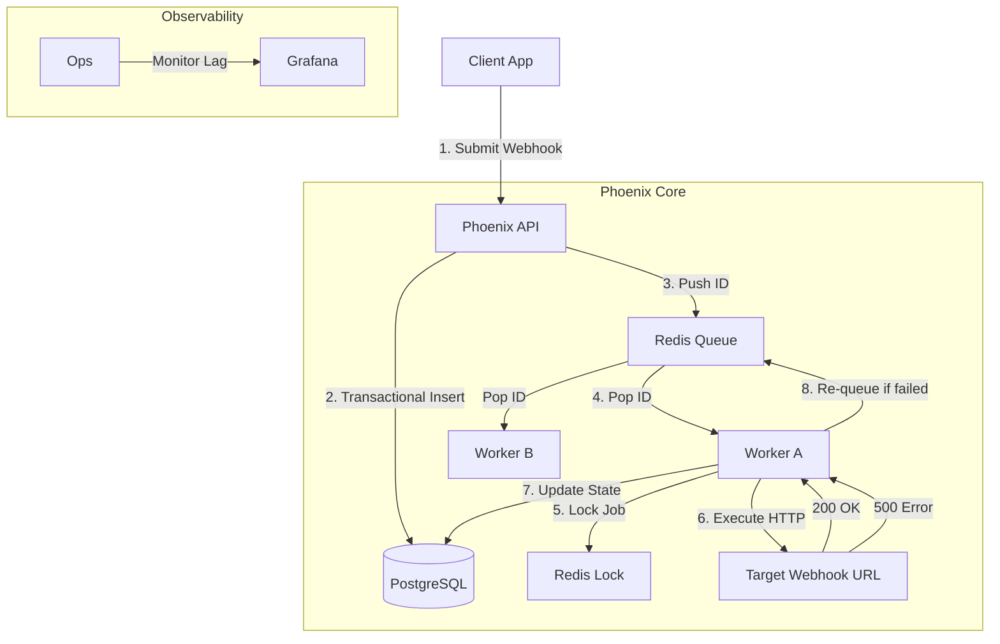

# PHOENIX — Architecture & Design Document

> **Status:** Draft
> **Pattern:** Competitive Workers / Leaderless / Transactional Outbox
> **Focus:** Guaranteed Webhook Delivery (B2B Reliability)

---

## 1. Problem Statement (The "Why")

In modern B2B SaaS, systems talk via Webhooks (Events).
**The Problem:**
1.  **Receivers are flaky:** Your customer's server might be down, slow, or returning 500s.
2.  **Fire-and-forget is reckless:** If you send a webhook and it fails, the data is lost.
3.  **Retries are dangerous:** If you retry blindly, you might double-charge a customer (duplicate events).

**Phoenix's Solution:** A standalone "Reliability Engine" that:
- **Persists every job** to Postgres before attempting delivery.
- **Retries smartly** with exponential backoff.
- **Guarantees delivery** (At-Least-Once) even if *Phoenix itself* crashes.

---

## 2. High-Level Architecture

We use a **Competitive Worker (Leaderless)** model.
Workers fight for jobs. There is no "Manager" node (SPOF).

### Components
1.  **Phoenix API (Spring Boot):** Accepts job submissions.
    *   **Crucial:** Validates payload, calculates `idempotency_key`, inserts to DB `jobs` table (status: `CREATED`).
2.  **Redis Queue:** A simple list of Job IDs waiting to be processed.
3.  **Worker Nodes (Spring Boot):**
    *   Pop ID from Redis.
    *   Acquire distributed lock (Redlock).
    *   Execute the HTTP POST.
    *   Update DB status.
4.  **Recovery Demon (Optional):** Scans DB for "orphaned" jobs (stuck in `RUNNING` for > 5 mins) and re-queues them.

---

## 3. The "Competitive Worker" Model

**Why Leaderless?**
- **Pros:** simple scaling (just add pods), no election logic complexity.
- **Cons:** Race conditions.
- **Mitigation:** We use `SELECT ... FOR UPDATE SKIP LOCKED` in Postgres or Redis Locks to ensure only one worker touches a job.

---

## 4. Failure Scenarios (The "What Ifs")

| Scenario | Behavior |
| :--- | :--- |
| **Redis Dies** | **Safe.** The queue is lost, but the *State of Truth* is in Postgres. The Recovery process (polling) will pick up pending jobs. |
| **Worker Crashes (Mid-Job)** | The job stays `RUNNING` in DB. After timeout (5m), another worker picks it up (At-Least-Once). |
| **Target URL Down** | Job transitions to `RETRY_PENDING`. Re-queued with exponential backoff (2s, 4s, 8s...). |
| **Double Submission** | API checks `idempotency_key`. If it exists, return 200 (idempotent success) but do *nothing*. |

---

## 5. Persistence Strategy (Failure-First)

**Rule:** We never trust Redis with data we can't afford to lose.
- **Postgres:** The bank vault. Holds the payload, status, and history.
- **Redis:** The scratchpad. Holds the queue and locks.

If Redis is wiped, we just re-hydrate the queue from Postgres.

---

## 6. Trade-offs (Staff Level)

1.  **Throughput vs. Reliability:**
    *   *Trade-off:* Writing to Postgres *before* queuing adds latency (disk I/O).
    *   *Justification:* We are selling "Guaranteed Delivery", not "Microsecond Latency". Losing a webhook is unacceptable.

2.  **At-Least-Once vs. Exactly-Once:**
    *   *Trade-off:* We might deliver the webhook twice (e.g., worker crashes *after* POST but *before* DB update).
    *   *Justification:* Exactly-Once is impossible in distributed systems (CAP theorem). We guarantee delivery; the *receiver* must handle idempotency.

---

## 7. Next Steps (Implementation)

1.  **Core Engine:** Build Core Engine (API + DB + Worker skeleton).
2.  **Crash Recovery:** Implement the "Crash Recovery" logic.
3.  **Concurrency:** Add Redis Locking & Concurrency.
