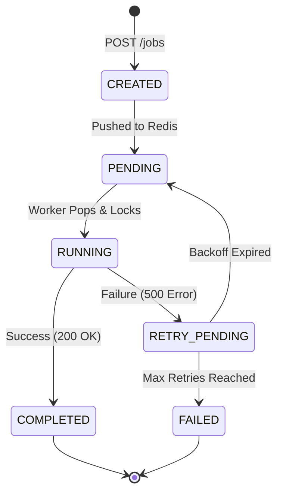

# Job Lifecycle & State Machine

> **The Heart of Phoenix:** How a job moves from "Idea" to "Done" without getting lost.

---

## 1. The States

| State | Definition |
| :--- | :--- |
| `CREATED` | Just received. Persisted in DB. Not yet queued. |
| `PENDING` | In the Redis queue. Waiting for a worker. |
| `RUNNING` | A worker has locked it and is executing the HTTP call. |
| `COMPLETED` | HTTP 200 received. Success. |
| `FAILED` | HTTP 4xx/5xx received. Retries exhausted. Dead Letter Queue candidate. |
| `RETRY_PENDING` | Failed, but has retries left. Waiting for backoff timer. |

---

## 2. The Transitions (State Machine)

---

## 3. Idempotency (The Safety Net)

**Problem:** Client sends the same job twice (e.g., user double-clicks "Pay").
**Solution:** `idempotency_key` (Unique Constraint in DB).

**Flow:**
1.  Client sends `POST /jobs` with `idempotency_key: "charge_123"`.
2.  Phoenix tries `INSERT INTO jobs ...`.
3.  **Success:** Returns `201 Created`.
4.  Client sends again (network glitch?).
5.  Phoenix tries `INSERT ...`.
6.  **DB Error (Unique Constraint Violation):**
    - Phoenix catches error.
    - Returns `200 OK` (acts like it succeeded).
    - Does **NOT** queue a duplicate job.

---

## 4. Retry Logic (Exponential Backoff)

We don't want to hammer a down server.
**Formula:** `wait_time = base_seconds * (multiplier ^ retry_count)`

Example (Base 2s, Multiplier 2):
- Attempt 1 fail: Wait 2s
- Attempt 2 fail: Wait 4s
- Attempt 3 fail: Wait 8s
- Attempt 4 fail: Wait 16s...

This gives the receiver time to recover.
